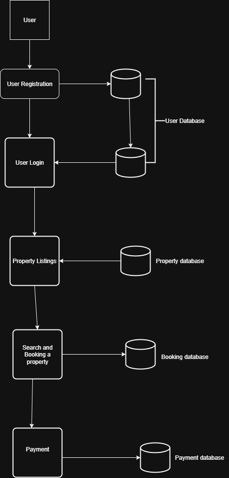

# Data Flow Diagram for Airbnb Clone Backend

This directory contains the Data Flow Diagram (DFD) for the Airbnb Clone project. The DFD illustrates the flow of data between different processes, entities, and data stores within the backend system.

## Data Flow Diagram

The diagram below shows the interactions and data flow for core functionalities such as user registration, property booking, payment processing, and review management.

