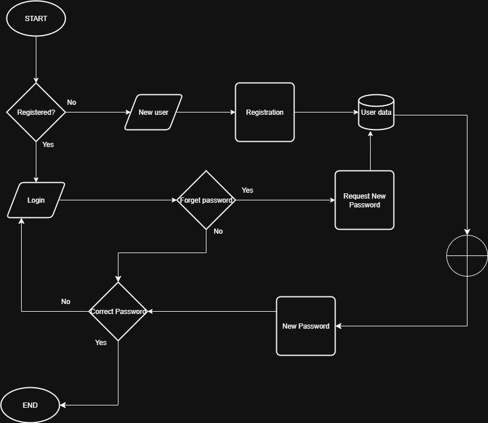

# Flowchart: User Registration & Login

This flowchart illustrates the steps and decisions in the User Registration and Login process of the Airbnb Clone backend. It shows how user data is validated, stored, and managed, including JWT generation and database interactions.

